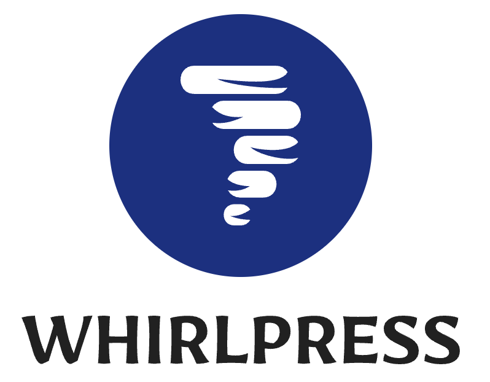

# WhirlPress.js

<p align="center">
  
</p>

## Headless Wordpress Starter Kit using RSC in Next.js 13

A highly-performant headless starter kit for Wordpress.com or Wordpress w/ Jetpack sites, using React Server Components in Next.js 13.

- Automatically adopts Wordpress site icon and name
- Routes setup mimicks native Wordpress pages for easier migration, plus additional routes
- Most pages are entirely built with Server Components, minimal client-side JS
- Simple theme, easy to customize
- Built-in SEO including OG tags, dynamic OG images, and Structured Data for posts

**Note**: This can be used for production today but is missing some recommended features like a sitemap and search. See the roadmap below.

## Getting Started

1. Clone this repo
2. Run `npm i`
3. Create a `.env.local` file with your public-api URL:

```
NEXT_PUBLIC_WORDPRESS_API_URL=https://public-api.wordpress.com/rest/v1.1/sites/<SITE ID OR ROUTE>/
```

ex:
```
NEXT_PUBLIC_WORDPRESS_API_URL=https://public-api.wordpress.com/rest/v1.1/sites/218966689/
# or
NEXT_PUBLIC_WORDPRESS_API_URL=https://public-api.wordpress.com/rest/v1.1/sites/myblog2700.wordpress.com/
```

## Roadmap

- Sidebar with popular or recent posts
- Native WP Menus
- Post stats (views, likes, comments)
- Sitemap
- Search ✅
- Comments
- Authors page
- RSS
- Optional OAuth sign-in support for submitting comments
- Revalidation settings + ISR endpoint
- Nicer fonts :D
